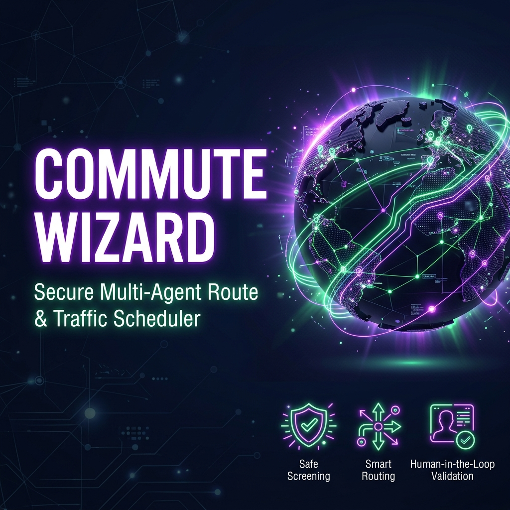
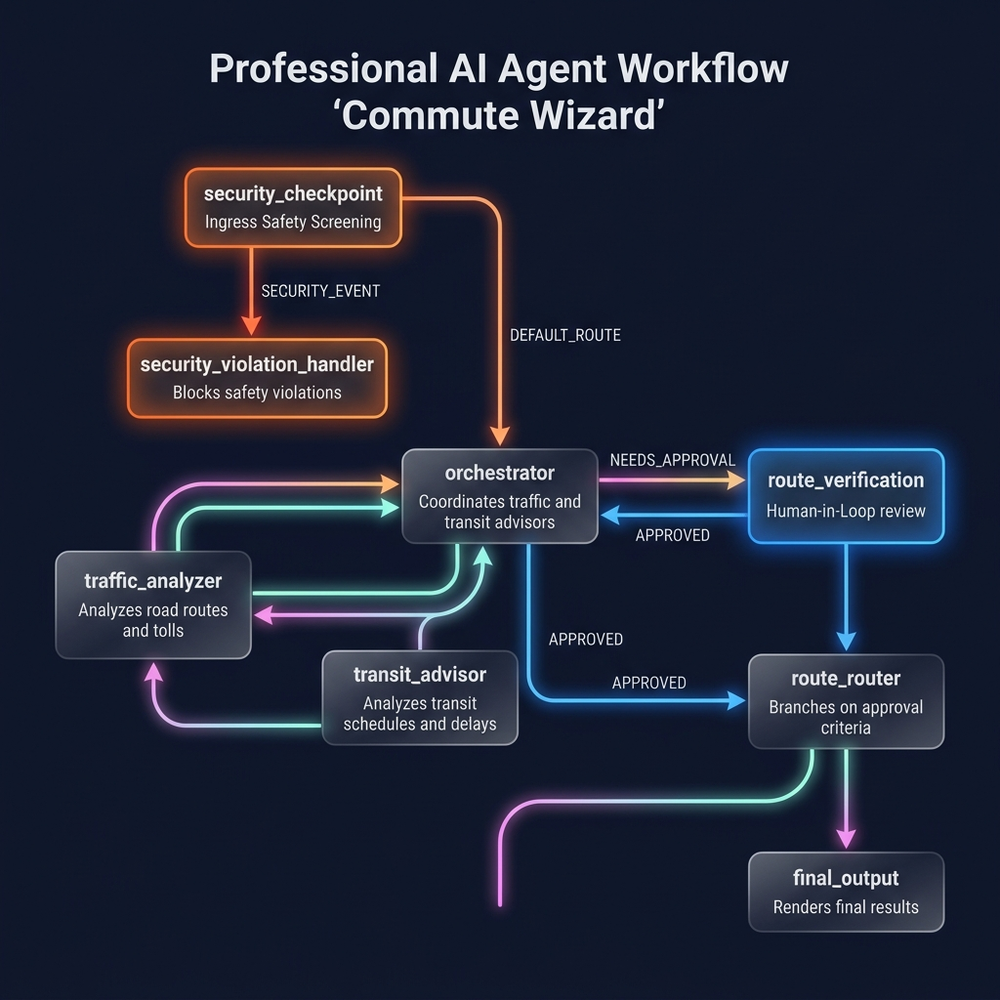

# Submission Write-Up: Commute Wizard

## Problem Statement
Daily commuting is full of unpredictability—ranging from unexpected road accidents and toll options to transit delays. Commuters need a tool that can dynamically analyze multiple options (driving, public transit, and safety checks) and offer integrated advice. Furthermore, because travel decisions can involve financial costs (tolls) or extreme time overheads, the agent needs a safe, deterministic execution structure with human oversight for critical actions.

---

## Solution Architecture
Commute Wizard uses the **ADK 2.0 Graph Workflow API** to route tasks securely through specialized sub-agents and gatekeeping nodes. Below is the solution's routing logic:

---

## Concepts Used

1.  **ADK Workflow**: Used to structure the application logic as a state-machine graph containing deterministic decision points (`route_router`), safety gates (`security_checkpoint`), and human-in-the-loop overrides (`route_verification`).
    *   *Reference*: Defined in [app/agent.py](file:///c:/Users/tarap/Downloads/adk-workflow/commute-wizard/app/agent.py#L123-L136).
2.  **LlmAgent**: Specialist agents (`traffic_analyzer`, `transit_advisor`) and a coordinator agent (`orchestrator`) defined with specific instructions and models.
    *   *Reference*: Defined in [app/agent.py](file:///c:/Users/tarap/Downloads/adk-workflow/commute-wizard/app/agent.py#L51-L81).
3.  **AgentTool**: Used by the `orchestrator` to delegate sub-queries to specialists (`traffic_analyzer` and `transit_advisor`) rather than doing all reasoning in a single prompt.
    *   *Reference*: Configured in the `orchestrator` tool list at [app/agent.py](file:///c:/Users/tarap/Downloads/adk-workflow/commute-wizard/app/agent.py#L80).
4.  **Security Checkpoint**: A preprocessing step that parses queries before any LLM agent gets invoked, protecting the system from prompt injection attacks or data leakage (PII).
    *   *Reference*: Implemented at [app/agent.py](file:///c:/Users/tarap/Downloads/adk-workflow/commute-wizard/app/agent.py#L37-L49).
5.  **Agents CLI & ADK Runners**: Used for testing, executing the developer playground, and packaging the workspace for reasoning engines runtime templates.
    *   *Reference*: Leveraged in [app/agent_runtime_app.py](file:///c:/Users/tarap/Downloads/adk-workflow/commute-wizard/app/agent_runtime_app.py).

---

## Security Design

1.  **PII & Prompt Injection Screening (`security_checkpoint`)**:
    *   By validating the query at the ingress node, we prevent malicious users from overriding the agent's instructions (jailbreaking) or sending personal data (such as credit cards or SSNs) to backend LLMs.
2.  **Safe Failure Handler (`security_violation_handler`)**:
    *   Separating the violation handler into its own terminal node ensures that once a query is flagged, the workflow exits safely and immediately without invoking further LLMs, minimizing risk and API consumption.
3.  **Local Credentials Mock**:
    *   In the local testing runner, live GCP authentication is bypassed via `google.auth.default` monkeypatching, securing developer credentials and ensuring local runs use local key stores securely.

---

## Agent / Specialist Design

*   **`traffic_analyzer`**: Dedicated solely to driving options, road networks, traffic patterns, and identifying toll charges. This specialization keeps prompt tokens smaller and results more accurate.
*   **`transit_advisor`**: Focused entirely on public rail, buses, schedule delays, and transit transfers.
*   **`orchestrator`**: Synthesizes the reports from both specialists, balancing the driving route against transit times, and flagging toll routes or high delay routes with the keyword `"NEEDS_APPROVAL"` to alert the downstream router.

---

## Human-in-the-Loop (HITL) Flow

*   **Trigger Condition**: When the orchestrator recommends a route containing tolls or a transit route with a delay exceeding 30 minutes, it appends the token `NEEDS_APPROVAL`.
*   **Implementation**: The `route_router` inspects the output. If the token is found, the workflow branches to `route_verification`.
*   **Pause & Resume**: The `route_verification` node yields a `RequestInput` object. The execution halts, saving the session state. Once the user replies (e.g., via the Playground UI), the node resumes execution, inspects the response, updates the state with `approved=True` or `False`, and finishes at `final_output`.

---

## Demo Walkthrough

1.  **Standard Driving Commute**:
    *   Query: *"Help me commute from Austin to San Antonio, driving only, no tolls."*
    *   Orchestrator gets driving routes from `traffic_analyzer`. No tolls are found, and delays are minimal.
    *   The workflow routes directly to `final_output` and displays the routes immediately.
2.  **Toll Route Approval**:
    *   Query: *"Drive SF to Oakland, taking the Bay Bridge toll."*
    *   The orchestrator identifies toll routes.
    *   The workflow pauses, showing a prompt: *"The proposed driving route has tolls or significant transit delays. Do you approve this route? (type 'yes' or 'no')"*.
    *   Entering "yes" resumes the workflow, showing the route as approved.
3.  **PII Check block**:
    *   Query: *"Navigate me home. My card number is 4111 2222 3333 4444."*
    *   Input matches regex/security criteria at the checkpoint.
    *   The flow immediately terminates via `security_violation_handler` displaying the block notification.

---

## Impact / Value Statement

Commute Wizard reduces the risk of accidental toll billing and unexpected travel delays by combining automated AI specialists with human oversight. Commuters get accurate, curated route options while managers or users retain full control over financial decisions (tolls) and safety compliance before routes are finalized.
